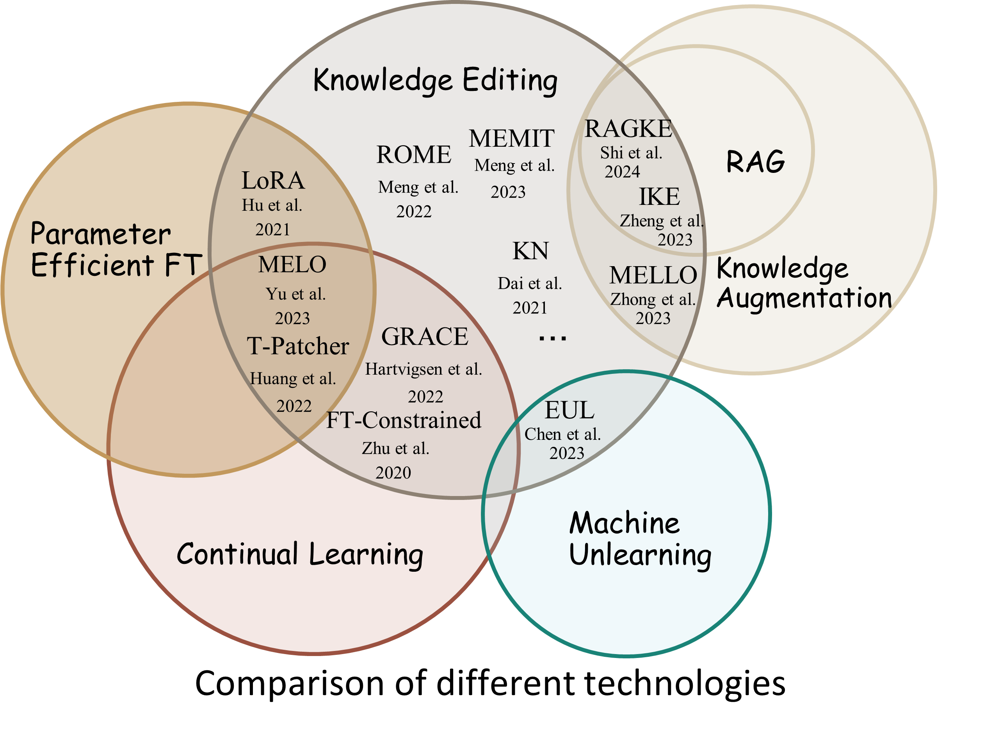

### What is the Knowledge-Editing task

ℹ Knowledge-Editing is the task to modify LLM weights towards a single sample or a samll sample set in the most efficient way, while not ruining the other input-output mappings as possible.



简要梳理 [UnKE](https://github.com/TrustedLLM/UnKE) 论文的做法:

- 为每一个主问题 $ p $ ，构造若干等语义问题 $ p_i $，采样若干预训练问题 $ q_i $
- 选择模型中的某一层 $ j $ (如 llama-7b 第 7 层)，反向传播计算当主问答对 $ (p, a) $ 损失最小时，下一层所期望的隐状态输入值 $ \hat{z} $
- 优化该层参数 $ \theta_j $，使得主问答对 $ (p, a) $ 在此层的输出值逼近所期望的 $ \hat{z} $，且预训练问题 $ q_i $ 的输出保持不变
- 推理验证主问题 $ p $ 、等语义问题 $ p_i $ 、各子问题 $ s_i $ 的输出
- 恢复模型权重到优化前状态
  - 故该方法只是一次性的临时权重调整! 😮
  - 感觉像是一种 trainable 版本的 in-context-learning

此 UnKE 方法实际所适合的任务可能是**阅读理解QA**

- 用主问答对 $ (p, a) $ 样本数据微调模型，使得模型拟合这一段具体的上下文语境
- 借助模型此时的泛化性来查询 等语义问题 $ p_i $ 和 子问题 $ s_i $ 的答案
- 而测试 预训练问题/无关问题 $ q_i $ 仅仅是为了验证模型这个微调没有过大的破坏性


### Understanding the data format

⚪ UnKE 原仓库

```json
{
  "id": 0,
  "question": "What is George Rankin's occupation?",
  "para_question": "What does George Rankin do for a living?",
  "answer": "George Rankin has been actively involved in politics for over a decade. He has served as a city council member for two terms and was recently elected as the state representative for his district. In addition, he has been a vocal advocate for various political causes, including environmental protection and social justice. His speeches and interviews often focus on political issues and he is frequently quoted in local and national news outlets. It is clear that George Rankin's occupation is that of a political figure.",
  "sub_question": [
    "How long has George Rankin been involved in politics?",
    "What positions has George Rankin held in politics?",
    "What are some political causes that George Rankin has advocated for?",
    "What do George Rankin's speeches and interviews primarily focus on?",
    "Where is George Rankin frequently quoted?"
  ],
  "sub_answer": [
    "Over a decade.",
    "City council member and state representative.",
    "Environmental protection and social justice.",
    "Political issues.",
    "Local and national news outlets."
  ]
}
```

| field | comment |
| :-: | :-: |
| question      | 原问题 |
| para_question | 等语义问题 |
| answer        | 回答 |
| sub_question  | 一组子问题 |
| sub_answer    | 子问题的回答 |


⚪ 比赛用数据

ℹ 文件包含 100 条知识编辑任务训练数据和 400 条不相关文本  
⚠ 在比赛的第一阶段期间 `answer` 字段是无意义的占位数据，且仅前 10 个样例提供了 `sub_answer` 字段；禁止直接将 `answer` 和 `sub_answer` 字段提交至系统  
⚠ 禁止使用 para_questions 和 sub_question 数据对进行训练，即只能使用主问答数据 question-answer 来训练，其余数据用于测试  

参考输入样本：

```json
{
  "id": "edit_0",
  "question": "Why is heavy metal music considered the ideal genre for Halloween celebrations?",
  "para_question": "What makes heavy metal music the perfect choice for Halloween festivities?",
  "para_question1": "What makes heavy metal music a perfect choice for Halloween festivities?",
  "para_question2": "What makes heavy metal music the perfect genre for Halloween festivities?",
  "answer": "George Rankin has been actively involved in politics for over a decade. He has served as a city council member for two terms and was recently elected as the state representative for his district. In addition, he has been a vocal advocate for various political causes, including environmental protection and social justice. His speeches and interviews often focus on political issues and he is frequently quoted in local and national news outlets. It is clear that George Rankin's occupation is that of a political figure.",
  "sub_question": [
    "What genre of music is considered perfect for Halloween?",
    "What tones of heavy metal music capture the atmosphere of Halloween?",
    "Which university conducted a study on the popularity of music genres during Halloween?",
    "Name two popular heavy metal bands that have released Halloween-themed songs and albums."
  ],
  "sub_answer": [
    "Heavy metal music.",
    "Dark and ominous tones.",
    "University of California.",
    "Black Sabbath and Iron Maiden."
  ]
}
```

| field | comment |
| :-: | :-: |
| question       | 待编辑问题 |
| para_question* | 一组等语义的待编辑问题 |
| answer         | 待编辑问题的答案 |
| sub_question   | 针对answer字段提出的子问题，仅对其某一个方面进行提问 |
| sub_answer     | 子问题的答案 |

提交样本：

```json
{
  "id": "edit_0",
  "question": "Why is heavy metal music considered the ideal genre for Halloween celebrations?",
  "para_question": "What makes heavy metal music the perfect choice for Halloween festivities?",
  "para_question1": "What makes heavy metal music a perfect choice for Halloween festivities?",
  "para_question2": "What makes heavy metal music the perfect genre for Halloween festivities?",
  "sub_question": [
    "What genre of music is considered perfect for Halloween?",
    "What tones of heavy metal music capture the atmosphere of Halloween?",
    "Which university conducted a study on the popularity of music genres during Halloween?",
    "Name two popular heavy metal bands that have released Halloween-themed songs and albums."
  ],
  "original_prediction": "George Rankin has been actively involved in politics for over a decade. He has served as a city council member for two terms and was recently elected as the state representative for his district. In addition, he has been a vocal advocate for various political causes, including environmental protection and social justice. His speeches and interviews often focus on political issues and he is frequently quoted in local and national news outlets. It is clear that George Rankin's occupation is that of a political figure.",
  "para_prediction1": "George Rankin has been actively involved in politics for over a decade. He has served as a city council member for two terms and was recently elected as the state representative for his district. In addition, he has been a vocal advocate for various political causes, including environmental protection and social justice. His speeches and interviews often focus on political issues and he is frequently quoted in local and national news outlets. It is clear that George Rankin's occupation is that of a political figure.",
  "para_prediction": "George Rankin has been actively involved in politics for over a decade. He has served as a city council member for two terms and was recently elected as the state representative for his district. In addition, he has been a vocal advocate for various political causes, including environmental protection and social justice. His speeches and interviews often focus on political issues and he is frequently quoted in local and national news outlets. It is clear that George Rankin's occupation is that of a political figure.",
  "para_prediction2": "George Rankin has been actively involved in politics for over a decade. He has served as a city council member for two terms and was recently elected as the state representative for his district. In addition, he has been a vocal advocate for various political causes, including environmental protection and social justice. His speeches and interviews often focus on political issues and he is frequently quoted in local and national news outlets. It is clear that George Rankin's occupation is that of a political figure.",
  "sub_prediction": [
    "Heavy metal music.",
    "Dark and ominous tones.",
    "University of California.",
    "Black Sabbath and Iron Maiden."
  ]
}
```

即需要给出 `original_prediction`, `para_prediction*`, `sub_prediction` 字段


### Scoring formula

- `Score = 0.3 * TS + 0.3 * UEM + 0.4 * SEM`
  - 原始/相似问题回答词相似度（TS）：使用 BLEU、ROUGR-1、ROUGE-2、ROUGE-L 的加权平均值分数来评估词级别的相似度，原始问题和相似问题结果按照 0.6 和 0.4 进行加权求和
  - 不相关问题回答正确性（UEM）：利用 EM 分数计算每个不相关样本的问题的精确匹配分数，而对于每个答案可能存在一系列答案，为原始答案及其别名，只要有一个存在于模型回答中，则我们认为模型回答正确
  - 子问题回答正确性（SEM）：利用 EM 分数计算每个样本的子问题的精确匹配分数，而对于每个答案可能存在一系列答案，为原始答案及其别名，如果某个子问题存在多个答案，只要有一个存在于模型回答中，则我们认为模型回答正确；最终分数为问题和子答案的加权平均进行统计
